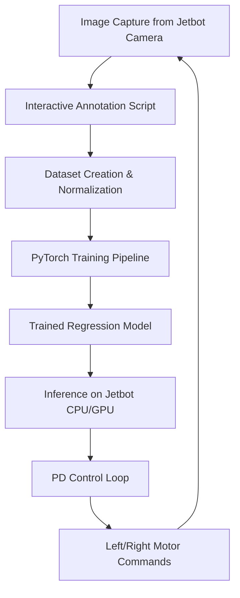

# Project Report: Deep Learning-Based Autonomous Road-Following for Jetbot

This report describes the development, dataset curation, model architecture, performance benchmarking, and control integration for a deep-learning-based autonomous road-following system deployed on a Jetbot mobile robot.

---

## 1. Approach Description

The project utilizes a **supervised coordinate regression** approach coupled with **closed-loop feedback control** to keep the Jetbot centered on a designated track. The end-to-end workflow spans from manual coordinate labeling to edge inference and motor duty-cycle actuation.



### 1.1. Step-by-Step Approach Details

#### A. Interactive Image Annotation
Since default dataset labels are often noisy or misaligned with the actual track configuration, an interactive mouse-clicking script (`annotation_script.py`) is used.
* The script displays each image in a `matplotlib` GUI window.
* Clicking on a point in the image calculates the pixel coordinates $(x_{px}, y_{px})$, normalizes them with respect to the width and height of the image, and saves them to a CSV dataset registry (`labels.csv`).
* Below is the core mouse event capture function from `annotation_script.py`:

```python
def get_click(img_array, title, index, total):
    result = {'coords': None, 'action': None}

    fig, ax = plt.subplots(figsize=(10, 8))
    ax.imshow(img_array)
    ax.set_title(f"[{index}/{total}] {title}  |  Click=label  •  S=skip  •  Q=quit", fontsize=10)
    ax.axis('on')

    def on_click(event):
        if event.inaxes != ax or event.button != 1:
            return
        x_px, y_px = event.xdata, event.ydata
        h, w = img_array.shape[:2]
        result['coords'] = (x_px / w, y_px / h)  # Normalize coordinates to [0.0, 1.0]
        plt.close(fig)   # Close plot window to resume loop

    def on_key(event):
        if event.key == 's':
            result['action'] = 'skip'
            plt.close(fig)
        elif event.key == 'q':
            result['action'] = 'quit'
            plt.close(fig)

    fig.canvas.mpl_connect('button_press_event', on_click)
    fig.canvas.mpl_connect('key_press_event', on_key)
    plt.tight_layout()
    plt.show()   # Blocks execution until the plot is closed

    if result['action']:
        return result['action']
    if result['coords'] is None:
        return 'skip'
    return result['coords']
```

#### B. Dataset Augmentation and Target Reprojection
To prevent overfitting to background lighting, camera alignment, or straight track configurations, we implement a custom dataset loader `XYDataset` that performs dynamic input transformations. 
- When cropping an image, the target coordinate must be mathematically translated and scaled (reprojected) to match the new image bounds:
  $$x_{new} = \frac{x_{old} \cdot W - \text{left}}{\text{crop\_w}}, \quad y_{new} = \frac{y_{old} \cdot H - \text{top}}{\text{crop\_h}}$$
- When horizontally flipping an image (for left-to-right symmetry generalization), the $x$ coordinate is updated as:
  $$x_{new} = 1 - x_{old}$$
- Below is the custom augmentation and PyTorch dataset implementation:

```python
def augment_image(image, x, y, max_crop=0.8):
    W, H = image.size
    scale = np.random.uniform(max_crop, 1.0)
    crop_w, crop_h = int(W * scale), int(H * scale)
    
    left = np.random.randint(0, W - crop_w + 1)
    top  = np.random.randint(0, H - crop_h + 1)
    
    # Crop image and reproject target coordinates
    image = transforms.functional.crop(image, top, left, crop_h, crop_w)
    x_new = (x * W - left) / crop_w
    y_new = (y * H - top)  / crop_h
    
    # Resize back to original target dimensions
    image = transforms.functional.resize(image, (H, W))
    return image, x_new, y_new

class XYDataset(torch.utils.data.Dataset):
    def __init__(self, directory, resolution, random_hflips=False, augment=False):
        self.directory     = directory
        self.resolution    = resolution
        self.random_hflips = random_hflips
        self.augment       = augment
        self.image_paths   = glob.glob(os.path.join(self.directory, '*.jpg'))
        self.color_jitter  = transforms.ColorJitter(0.3, 0.3, 0.3, 0.3)

    def __len__(self):
        return len(self.image_paths)

    def __getitem__(self, idx):
        image_path = self.image_paths[idx]
        image = PIL.Image.open(image_path)
        image = transforms.functional.resize(image, (self.resolution, self.resolution))
        width, height = image.size
        
        # Load normalized coordinates from precomputed label map
        x = float(get_x(os.path.basename(image_path), width))
        y = float(get_y(os.path.basename(image_path), height))
        
        if self.random_hflips and float(np.random.rand(1)) > 0.5:
            image = transforms.functional.hflip(image)
            x = 1 - x
            
        if self.augment:
            image, x, y = augment_image(image, x, y)
            
        image = self.color_jitter(image)
        image = transforms.functional.to_tensor(image)
        # Convert RGB to BGR format to match Jetbot camera format
        image = image.numpy()[::-1].copy()
        image = torch.from_numpy(image)
        image = transforms.functional.normalize(image, [0.485, 0.456, 0.406], [0.229, 0.224, 0.225])
        
        return image, torch.tensor([x, y]).float()
```

#### C. Neural Network Architecture Configuration
We modify state-of-the-art CNN classification backbones (ResNet-18 or MobileNet-V2) by replacing their final output classification layers with a linear regression layer outputting two continuous variables representing $(x, y)$ coordinate predictions.

```python
def build_model(model_name):
    if model_name == 'resnet18':
        # Replace the final fully connected layer (512 features) with 2 outputs
        m = models.resnet18(pretrained=True)
        m.fc = torch.nn.Linear(512, 2)
    elif model_name == 'mobilenet_v2':
        # Replace the classifier's linear projection (1280 features) with 2 outputs
        m = models.mobilenet_v2(pretrained=True)
        m.classifier[1] = torch.nn.Linear(1280, 2)
    else:
        raise ValueError(f'Unknown model: {model_name}')
    return m
```

#### D. Closed-Loop Feedback Control (PD Controller)
The target $(x, y)$ predicted by the neural network represents where the robot should drive. This coordinate is translated into steering and motor outputs using a proportional-derivative (PD) controller:
1. **Target Angle calculation**: We compute the angular difference between the robot's straight ahead vector and the predicted target coordinate:
   $$\theta = \text{arctan2}(x - 0.5, 1.0 - y)$$
2. **PD Steering Equation**:
   $$\text{steering} = K_p \cdot \theta + K_d \cdot (\theta - \theta_{last}) + \text{bias}$$
3. **Motor Speed Assignment**: Left and right motor duty cycles are derived and clipped to $[0.0, 1.0]$.
4. Below is the implementation snippet from `model_testing.ipynb` / `live_demo.ipynb`:

```python
def compute_wheel_output(
    xy,
    speed_gain=SPEED_GAIN,
    steering_gain=STEERING_GAIN,
    steering_bias=STEERING_BIAS,
    steering_dgain=STEERING_DGAIN,
    angle_last=0.0,
):
    # Transform normalized predictions
    x = xy[0] - 0.5
    y = 1.0 - xy[1]  # Invert Y coordinate so 1.0 is far forward and 0.0 is close
    angle = np.arctan2(x, y)

    # PD Controller
    pid = angle * steering_gain + (angle - angle_last) * steering_dgain
    steering = pid + steering_bias

    # Convert steering adjustment to motor duty cycles
    left  = float(np.clip(speed_gain + steering, 0.0, 1.0))
    right = float(np.clip(speed_gain - steering, 0.0, 1.0))
    
    return {
        'x':        float(xy[0]),
        'y':        float(xy[1]),
        'angle':    float(angle),
        'steering': float(steering),
        'left':     left,
        'right':    right,
    }
```

#### E. Execution Loop on the Robot
During live track runs, the Jetbot runs a continuous cycle reading frames, executing model inference, updating the PD steering angle, and actuating the left and right motor wheels:

```python
# Simplified Live Execution Loop (from live_demo.ipynb / model_testing.ipynb)
angle_last = 0.0

for i in range(N_FRAMES):
    # 1. Read camera frame
    frame = camera.value

    # 2. Preprocess and Run Model Inference
    tensor = preprocess(frame).to(device)
    with torch.no_grad():
        xy = model(tensor).detach().cpu().numpy().flatten()

    # 3. Compute PD steering adjustments
    output = compute_wheel_output(xy, angle_last=angle_last)
    angle_last = output['angle']
    
    # 4. Actuate robot motors
    robot.left_motor.value  = output['left']
    robot.right_motor.value = output['right']
    
    time.sleep(0.05)  # control cycle interval
```

---

## 2. Dataset Description

The dataset consists of four different iterations of annotated track images. Each dataset contains JPEG images and a `labels.csv` file mapping image paths to normalized target coordinates.

### 2.1. Dataset Summary & Statistics

| Dataset Name | Image Count | Mean $X_{norm}$ | Mean $Y_{norm}$ | Labeling Strategy / Purpose |
| :--- | :---: | :---: | :---: | :--- |
| `dataset_labeled_1` | 413 | 0.5065 | 0.6037 | **Immediate Reactivity**: Labeled $\approx$ 3rd stripe from the robot (closer target). High stability but slower driving. |
| `dataset_labeled_2` | 401 | 0.5171 | 0.4812 | **Far Sight (Corner Cutting)**: Labeled target as far as possible. Aggressive corner-cutting, higher speed, but prone to derailment. |
| `dataset_labeled_4_fast` | 459 | 0.4961 | 0.4731 | Used for model benchmarking. Labeled for high-speed tracking. |
| `dataset_labeled_5` | 317 | 0.4860 | 0.5259 | Balanced annotation dataset. |

*Note on Coordinates: Coordinates are normalized to $[0, 1]$. Because $(0,0)$ is the top-left of the image, a lower mean $Y_{norm}$ (e.g., $0.4812$ vs $0.6037$) corresponds to target points that are higher up in the frame, which represents look-ahead points further down the track.*

### 2.2. Preprocessing & Data Augmentation
To ensure model generalization under variable lighting and positioning, the following pipeline is applied:
- **Resizing**: Images are scaled to the model input resolution ($224 \times 224$ or $112 \times 112$).
- **Color Jitter**: Brightness, contrast, saturation, and hue are randomly perturbed by up to 30%.
- **Random Crop & Resize**: Images are randomly cropped (scaling between 80% and 100% of original area) and resized back to the input dimensions, simulating scale/height variations. Target coordinates are mathematically reprojected:
  $$x_{new} = \frac{x_{old} \cdot W - \text{left}}{\text{crop\_w}}, \quad y_{new} = \frac{y_{old} \cdot H - \text{top}}{\text{crop\_h}}$$
- **Random Horizontal Flips**: The image is flipped horizontally with a 50% probability, and the target coordinate is updated ($x \leftarrow 1 - x$).
- **Normalization**: Normalized using standard ImageNet mean (`[0.485, 0.456, 0.406]`) and standard deviation (`[0.229, 0.224, 0.225]`).

---

## 3. Model Architecture

We evaluated two lightweight convolutional architectures suitable for real-world deployment on edge devices like the Jetbot:

1. **ResNet-18**:
   - A residual CNN backbone pre-trained on ImageNet.
   - The final fully connected (`fc`) classification layer is replaced with a linear layer mapping 512 features to 2 outputs (representing predicted $x$ and $y$).
2. **MobileNet-V2**:
   - An inverted-residual CNN optimized for mobile hardware using depthwise separable convolutions.
   - The final classifier linear layer (`classifier[1]`) is replaced with a linear layer mapping 1280 features to 2 outputs.

### 3.1. Training Configurations
- **Loss Function**: Mean Squared Error (MSE) Loss between predicted and ground-truth normalized coordinates.
- **Optimizer**: Adam optimizer with default PyTorch hyperparameters.
- **Duration**: 70 epochs.
- **Validation**: Checkpoints are saved on the minimum validation MSE loss.
- **Resolutions Evaluated**: $224 \times 224$ pixels and $112 \times 112$ pixels.

---

## 4. Error Analysis and Benchmarking

Performance benchmarking was conducted on the test split of `dataset_labeled_4_fast` (split: 356 train, 44 validation, 45 test) running on a Jetbot-compatible CUDA environment.

### 4.1. Quantitative Results

| Model | Resolution | Inference Latency (ms) | Throughput (FPS) | Avg Euclidean Error (px @ 224) |
| :--- | :---: | :---: | :---: | :---: |
| **ResNet-18** | **224x224** | **4.5** | **220.1** | **8.32 (Best)** |
| ResNet-18 | 112x112 | 4.2 | 238.9 | 9.75 |
| MobileNet-V2 | 112x112 | 6.0 | 167.7 | 10.64 |
| MobileNet-V2 | 224x224 | 4.6 | 219.4 | 12.60 |

*Note: Euclidean errors are scaled to a standard $224\times224$ reference frame to ensure a fair comparison across resolutions.*

### 4.2. Analysis & Insights
- **ResNet-18 Dominance**: ResNet-18 at 224x224 achieved both the highest accuracy (8.32px error) and exceptional latency (4.5ms). 
- **Convolutions vs. Depthwise Separable Convolutions**: Although MobileNet-V2 is theoretically more lightweight in terms of parameters, on Jetbot/CUDA hardware, ResNet-18's standard convolutions are highly optimized and run faster than MobileNet-V2's depthwise separable convolutions, which suffer from higher memory access overhead.
- **Resolution Trade-offs**: Reducing resolution to 112x112 yields a negligible speedup (4.5ms $\rightarrow$ 4.2ms) but increases tracking error significantly (8.32px $\rightarrow$ 9.75px for ResNet-18). Thus, 224x224 is the optimal operational resolution.
- **MobileNet Anomaly**: MobileNet-V2 at 224x224 suffered from worse accuracy (12.60px error) than its 112x112 counterpart. This is likely due to overfitting or difficulty regressing fine spatial coordinates when downscaling the high-dimensional feature map of the larger resolution without intermediate dense connections.

---

## 5. Conclusions and Recommendations

1. **Optimal Model Configuration**: The **ResNet-18 model operating at 224x224 resolution** is highly recommended. It provides the best trade-off, achieving the lowest Euclidean prediction error (8.32px) and running at 220 FPS, which is far beyond the Jetbot camera capture frame rate (typically 30 FPS).
2. **Labeling Strategy Impact**: 
   - A look-ahead point that is too close (`dataset_labeled_1`) leads to highly stable path following on sharp curves, but creates oscillations on straight segments and reduces average speed.
   - A look-ahead point that is too far (`dataset_labeled_2`) enables high-speed straight-line traversal, but increases derailment rates on tight turns.
   - **Recommendation**: A hybrid labeling approach where look-ahead distance is dynamic (closer on curves, further on straights) or utilizing `dataset_labeled_5` provides the most robust path tracking.

---

## 6. Run Instructions for the Instructor

Follow these steps to run the pipeline, from dataset annotation to training, testing, and deployment.

### 6.1. Environment Setup
Make sure `uv` is installed, then run the commands. All commands should be executed from the root of the project.

### 6.2. Step 1: Labeling / Annotating Images
To run the interactive annotation tool to select target coordinates on custom images:
```bash
uv run python3 annotation_script.py
```
- Click on the image to place a label.
- Press `S` to skip the current image.
- Press `Q` to save progress and quit.
- Output labels will be stored in `datasets/dataset_labeled_5/labels.csv`.

### 6.3. Step 2: Training the Model
To train the ResNet-18 model on a labeled dataset, open the training notebook or run the python script equivalent:
- Open [train_model.ipynb](file:///Users/daniel/Developer/Projects/robotics-project/train_model.ipynb) and run cells to train on your dataset.
- You can change `DATASET_NAME` inside the notebook to switch between datasets.
- Trained model checkpoints will be saved under the `models/` directory (e.g. `models/dataset_labeled_2/best_steering_model_xy.pth`).

### 6.4. Step 3: Benchmarking and Local Testing
To test the trained model locally (on CPU) and generate sample predictions:
- Open [model_testing.ipynb](file:///Users/daniel/Developer/Projects/robotics-project/model_testing.ipynb) and run the cells.
- This will load the model, evaluate inference times, and show prediction overlays on sample images.

### 6.5. Step 4: Deploying on the Jetbot Track
To run the robot on the track:
1. Copy [live_demo.ipynb](file:///Users/daniel/Developer/Projects/robotics-project/live_demo.ipynb) and the trained model file (`models/dataset_labeled_2/model_to_import.pth`) to the Jetbot.
2. In the Jetbot notebook interface, open `live_demo.ipynb`.
3. Set the correct path to the `.pth` model file.
4. Set the control gains:
   - `SPEED_GAIN` (usually `0.2` - `0.4` for safety, up to `1.0` for speed)
   - `STEERING_GAIN` (proportional steering factor)
   - `STEERING_DGAIN` (derivative factor to reduce oscillations)
   - `STEERING_BIAS` (to compensate for hardware pull)
5. Run the cells to launch the camera, initialize the robot, and execute the autonomous driving control loop.
